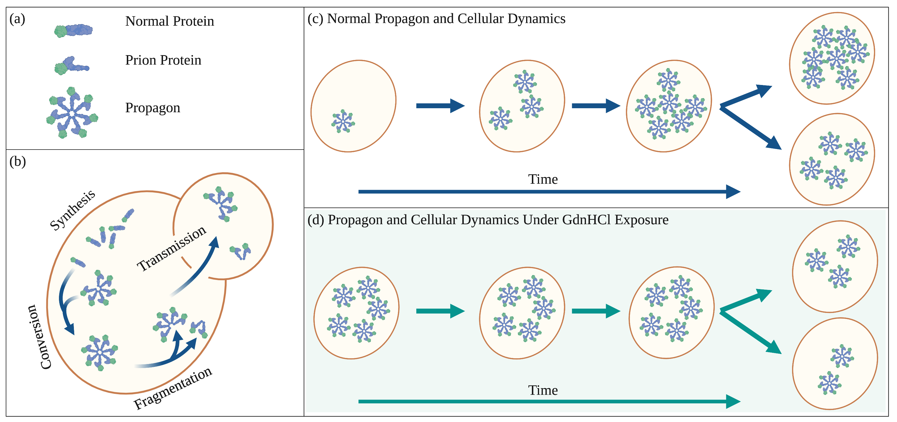
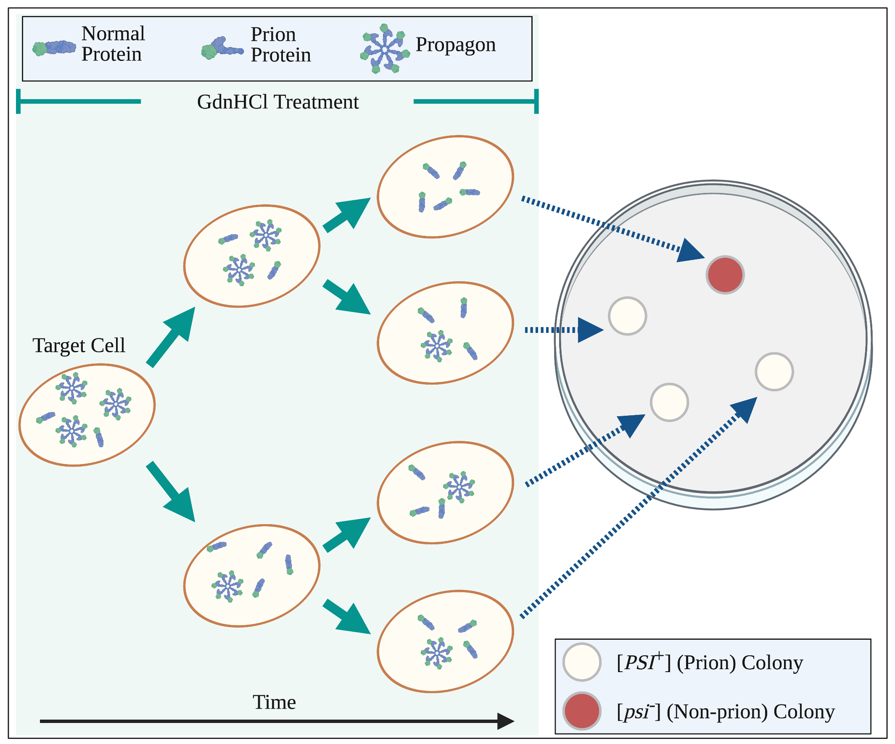
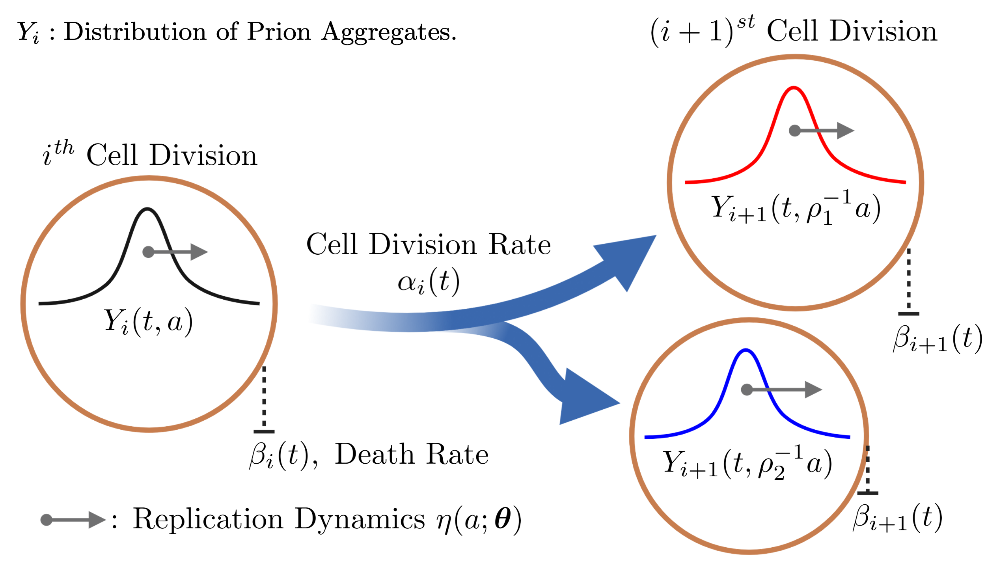
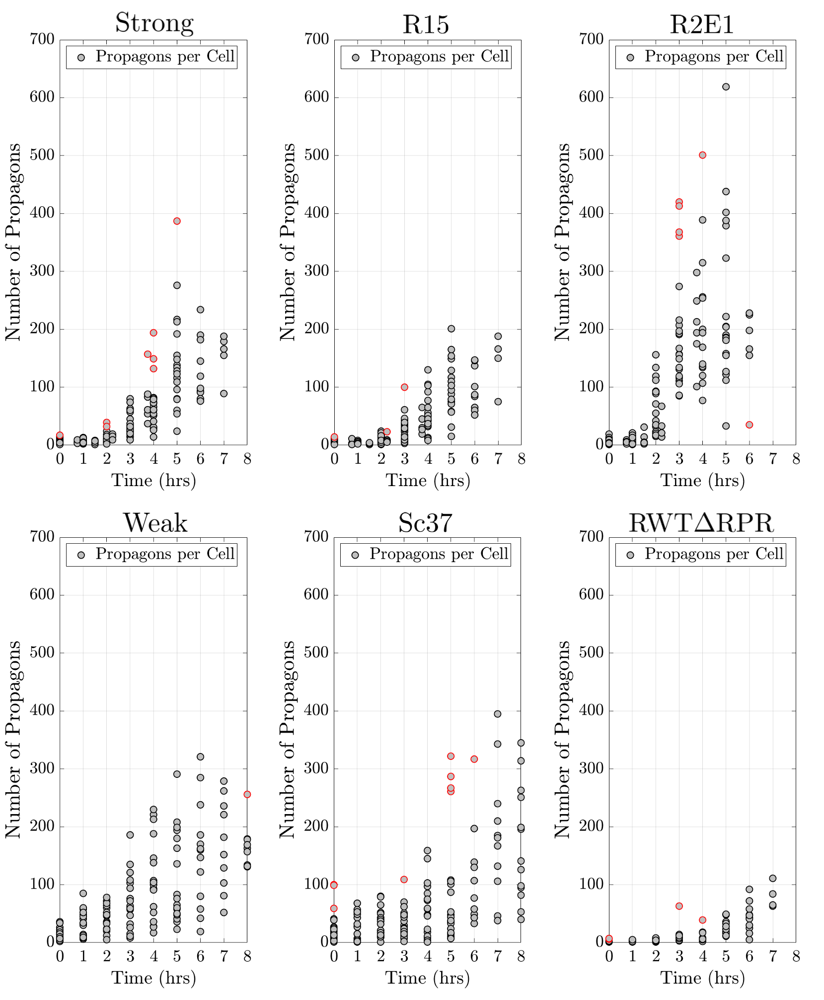
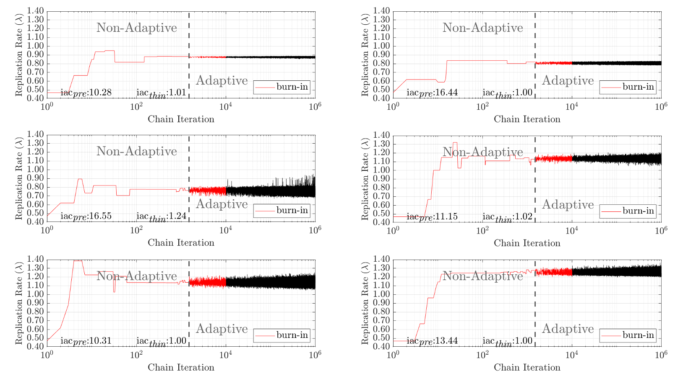

# Propagon Replication Rates & Asymmetric Transmission
Code for estimation of replication rate and asymmetric distribution using experimental aggregate count 
publication: <a href="https://journals.plos.org/ploscompbiol/article?id=10.1371/journal.pcbi.1010107">PLOS Computational Biology Article</a>

<strong>Included:</strong>
<ul>
  <li><b><em>propagon_data_raw</em></b>: Folder containing experimental aggregate count datasets for six prion variants. </li>
  <li><b><em>propagon_data_filtered_iqr</em></b>: Folder containing aggregate counts data filtered for outliers. </li>
  <li><b><em>propagon_data_down_sampled</em></b>: Folder containing aggregate counts data downsampled in time. </li>
  <li><b><em>Example_Simulate_Data.m</em></b>: The script shows how to generate simulated data using the functions in the <b><em>/code/</em></b> folder. </li>
  <li><b><em>Example_Parameter_Estimation.m</em></b>: The script shows how to apply the adaptive Metropolis algorithm to simulated and experimental data. </li>
</ul>

<ol> 
   <li>Prion Aggregate Replication Dynamics.  </li>
   <li>Prion Aggregate Count Experiments. </li>
   <li>Diagram of structured model, aggregate distribution, and cell division. </li>
   <li>Data of prion aggregate counts for six prion variants. </li>
   <li>Estimates of prion replication rates. </li>
</ol>
